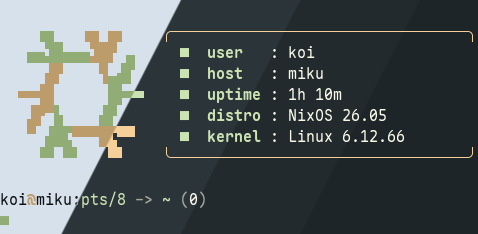
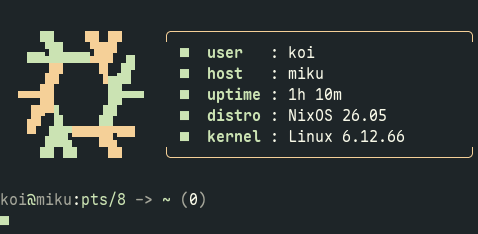
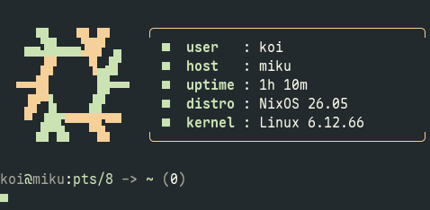
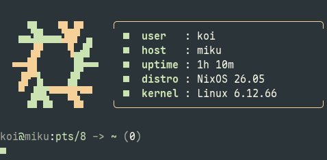
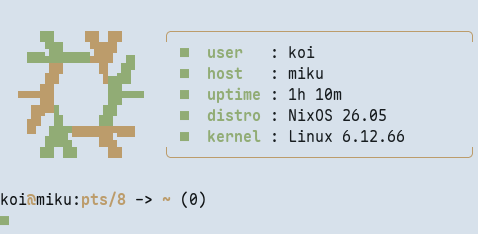

<h3 align="center">
   
  Evergarden for TTY
</h3>

  
  
  

  

### Previews

  
Winter

  

  
Fall

  

  
Spring

  

  
Summer

  

### Usage

Copy the contents of your preferred variant from `themes/` to your kernel parameters

### Thanks to <3

- [koi](https://codeberg.org/koibtw)
- [catppuccin](https://github.com/catppuccin/tty)

  

